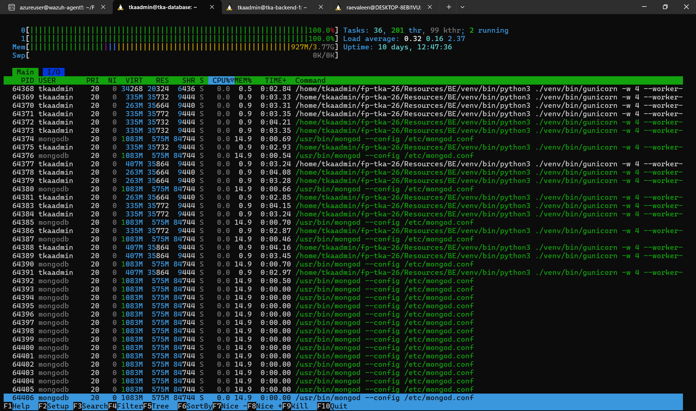
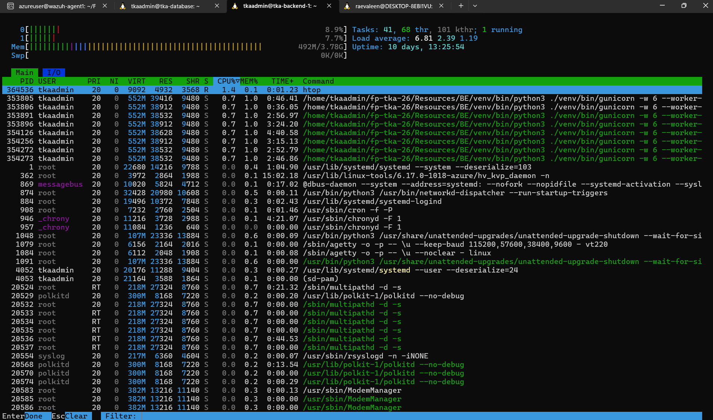

# Final Project Kelompok 5 — Order Processing Service

## Anggota

| NRP         | Nama                           |
|-------------|--------------------------------|
| 5027241007  | Revalina Erica Permatasari     |
| 5027241028  | Hansen Chang                   |
| 5027241043  | Azaria Raissa M                |
| 5027241052  | Salsa Bil Ulla                 |
| 5027241090  | Tiara Fatimah Azzahra          |
| 5027241095  | Nafis Faqih Almuzaky Maolidi   |
| 5027241102  | Rayhan Agnan Kusuma            |
| 5027241120  | Mohamad Arkan Zahir Asyafiq    |

---

## 1. Introduction

Final Project ini merupakan implementasi dari mata kuliah Teknologi Komputasi Awan, di mana kelompok kami bertindak sebagai Cloud Engineer yang diminta mendeploy, mengonfigurasi, dan mengoptimalkan sebuah **Order Processing Service** untuk sebuah startup e-commerce. Layanan ini menjadi inti dari proses transaksi pelanggan: membuat pesanan, mengecek status pesanan, dan menampilkan riwayat transaksi.

Backend disediakan dalam bentuk REST API berbasis **Python (Flask)** dengan database **MongoDB**, dideploy menggunakan **Gunicorn** sebagai WSGI server di belakang **Nginx** sebagai load balancer. Tantangan utama dari proyek ini adalah merancang arsitektur cloud yang mampu menangani lonjakan traffic secara stabil, namun tetap berada dalam batas anggaran maksimal **Rp 1.300.000/bulan (~$75)**.

Untuk mengukur kemampuan sistem dalam menangani beban, dilakukan **load testing** menggunakan Locust dengan lima skenario pengujian berbeda, dijalankan dari host yang terpisah dari server aplikasi agar hasil pengujian tidak terdistorsi oleh resource lokal.

---

## 2. Arsitektur Cloud


*Gambar 1. Diagram arsitektur cloud Kelompok 5 — VM1 sebagai Nginx load balancer, VM2 dan VM3 sebagai backend Flask/Gunicorn, MongoDB di VM3.*

Sistem dideploy menggunakan ekosistem **Microsoft Azure**, dengan tiga Virtual Machine yang masing-masing memiliki peran terpisah:

- **VM 1 (`tka-loadbalancer`)** — menjalankan Nginx sebagai reverse proxy/load balancer sekaligus menyajikan file frontend React (port 3000). IP Publik: `20.198.72.134`.
- **VM 2 (`tka-backend-1`)** — menjalankan backend Flask di belakang Gunicorn (6 workers, gthread, port 5001). IP Publik: `98.70.0.131`.
- **VM 3 (`tka-database`)** — menjalankan MongoDB sebagai database server sekaligus menjalankan Gunicorn backend kedua (4 workers, gthread, port 5001). IP Privat: `10.0.0.6`.

Nginx melakukan load balancing secara **round-robin** antara VM 2 dan VM 3, sehingga kedua VM backend saling berbagi beban request secara bergantian.

### Spesifikasi VM & Estimasi Biaya

| Komponen Server | Fungsi Utama | Ukuran (Size) Azure | Harga per Bulan |
|---|---|---|---|
| **VM 1 (`tka-loadbalancer`)** | Frontend Web Server & Nginx Load Balancer | `Standard_B2ats_v2` (2 vCPU, 1GB RAM) | $7.81 |
| **VM 2 (`tka-backend-1`)** | Python Flask Backend API (Gunicorn, 6 workers) | `Standard_B2als_v2` (2 vCPU, 4GB RAM) | $31.24 |
| **VM 3 (`tka-database`)** | MongoDB Database Server + Flask Backend (Gunicorn, 4 workers) | `Standard_B2als_v2` (2 vCPU, 4GB RAM) | $31.24 |
| **TOTAL BIAYA** | | | **$70.29** |

Total biaya berada di bawah batas anggaran maksimal $75/bulan.

### Alasan Pemilihan Konfigurasi

Backend mendapat alokasi RAM lebih besar (4GB) dibanding load balancer (1GB) karena proses Python/Gunicorn lebih berat dibanding Nginx untuk fungsi reverse proxy. Database dipisah ke VM tersendiri mengikuti rekomendasi soal bahwa memisahkan MongoDB dari application server biasanya meningkatkan performa secara signifikan, karena I/O database tidak akan bersaing dengan proses komputasi aplikasi.

---

## 3. Implementasi

### 3.1 Backend (Flask + Gunicorn)

Backend dijalankan di dua VM terpisah, masing-masing dengan satu proses Gunicorn multi-worker:

**VM 2 (tka-backend-1):**
```bash
./venv/bin/gunicorn -w 6 --worker-class gthread --threads 4 \
  -b 0.0.0.0:5001 --timeout 60 --keep-alive 5 --daemon app:app
```

**VM 3 (tka-database):**
```bash
./venv/bin/gunicorn -w 4 --worker-class gthread --threads 4 \
  -b 0.0.0.0:5001 --timeout 60 --keep-alive 5 --daemon app:app
```

Total: 10 worker Gunicorn yang menangani request secara paralel (6 di VM 2, 4 di VM 3). Penggunaan `gthread` worker class memungkinkan setiap worker menangani request secara konkuren menggunakan thread.

Backend terhubung ke MongoDB di VM 3 (`10.0.0.6:27017`) dengan connection pool yang dikonfigurasi sebagai berikut:

```python
MONGO_URI = os.environ.get("MONGO_URI", "mongodb://10.0.0.6:27017/")

client = MongoClient(
    MONGO_URI,
    maxPoolSize=200,
    minPoolSize=10,
    connectTimeoutMS=5000,
    socketTimeoutMS=10000,
    serverSelectionTimeoutMS=5000
)
```

### 3.2 Load Balancer (Nginx)

Nginx dikonfigurasi sebagai reverse proxy yang meneruskan request ke dua backend server secara round-robin:

```nginx
upstream backend_servers {
    server 98.70.0.131:5001;  # VM2 tka-backend-1
    server 10.0.0.6:5001;     # VM3 tka-database
    keepalive 32;
}

server {
    listen 80 default_server;
    listen [::]:80 default_server;
    server_name _;

    gzip on;
    gzip_types text/plain application/json application/javascript text/css;
    gzip_min_length 1000;

    proxy_http_version 1.1;
    proxy_set_header Host $host;
    proxy_set_header X-Real-IP $remote_addr;
    proxy_set_header X-Forwarded-For $proxy_add_x_forwarded_for;
    proxy_connect_timeout 10s;
    proxy_send_timeout 30s;
    proxy_read_timeout 30s;

    location /api/ {
        rewrite ^/api(/.*)$ $1 break;
        proxy_pass http://backend_servers;
        proxy_set_header Connection "";
    }

    location /auth    { proxy_pass http://backend_servers; proxy_set_header Connection ""; }
    location /orders  { proxy_pass http://backend_servers; proxy_set_header Connection ""; }
    location /products { proxy_pass http://backend_servers; proxy_set_header Connection ""; }
    location /health  { proxy_pass http://backend_servers; proxy_set_header Connection ""; }
    location /admin   { proxy_pass http://backend_servers; proxy_set_header Connection ""; }

    location / {
        proxy_pass http://127.0.0.1:3000;
        proxy_set_header Upgrade $http_upgrade;
        proxy_set_header Connection 'upgrade';
        proxy_cache_bypass $http_upgrade;
    }
}
```

### 3.3 Database (MongoDB)

MongoDB dijalankan sebagai service di VM 3 dan dikonfigurasi agar dapat diakses dari VM backend melalui jaringan internal. Index dibuat pada field-field yang sering diquery untuk menjaga performa saat data menumpuk:

```js
db.orders.createIndex({ order_id: 1 })
db.orders.createIndex({ created_at: -1 })
db.orders.createIndex({ user_id: 1, created_at: -1 })
```

Database diisi dengan data seed menggunakan `mongorestore` dari folder `Resources/DB/dump/`, menghasilkan 10.000 dokumen awal di koleksi `orders`.

### 3.4 Frontend

Frontend dibangun menggunakan React (TanStack Start) yang melakukan request ke backend melalui Nginx. Frontend menyajikan halaman katalog produk, keranjang belanja, riwayat pesanan, autentikasi (login), dan dashboard admin.

---

## 4. Hasil Pengujian Endpoint

Pengujian setiap endpoint dilakukan menggunakan Postman terhadap base URL `http://20.198.72.134`.

| Endpoint | Method | Hasil |
|---|---|---|
| `/auth/login` | POST | 200 OK — berhasil login, mengembalikan JWT token |
| `/products` | GET | 200 OK — mengembalikan daftar produk dari MongoDB |
| `/orders` | POST | 201 Created — order baru berhasil dibuat |
| `/orders` | GET | 200 OK — riwayat order berhasil diambil |
| `/orders/<id>` | GET | 200 OK — detail/status order berhasil diambil |
| `/orders/<id>/status` | PUT | 200 OK — status order berhasil diperbarui |

.png)
*Gambar 2. POST /auth/login — login berhasil, response berisi JWT token.*

.png)
*Gambar 3. GET /products — daftar produk berhasil diambil dari MongoDB.*

.png)
*Gambar 4. POST /orders — order baru berhasil dibuat dengan status pending.*

.png)
*Gambar 5. GET /orders — riwayat seluruh order berhasil diambil.*

.png)
*Gambar 6. GET /orders/<id> — detail dan status order berhasil diambil.*

.png)
*Gambar 7. PUT /orders/<id>/status — status order berhasil diperbarui oleh admin.*

---

## 5. Hasil Load Testing (Locust)

Pengujian dilakukan dari VM eksternal (`wazuh-agent1`, IP `70.153.24.223`) yang berada di luar infrastruktur kelompok ini, menggunakan `Resources/Test/locustfile.py` terhadap host `http://20.198.72.134`. Sebelum setiap skenario, koleksi `orders` yang ter-insert selama pengujian dibersihkan dan di-restore ulang ke kondisi seed 10.000 dokumen.

### Ringkasan Hasil

| Skenario | Spawn Rate | Peak User (0% failure) | RPS Aggregated | Keterangan |
|---|---|---|---|---|
| 1 — Maksimum RPS | 1 user/detik | 350 user | **213.2 RPS** | Failure pertama muncul di 750 user |
| 2 — Peak Concurrency | 50 user/detik | **450 user** | ~154 RPS | Failure muncul di 600 user |
| 3 — Peak Concurrency | 100 user/detik | **700 user** | ~141 RPS | Failure muncul di 800 user |
| 4 — Peak Concurrency | 200 user/detik | 400 user | ~119 RPS | Failure muncul di 600 user (13% failure rate) |
| 5 — Peak Concurrency | 500 user/detik | **700 user** | ~141 RPS | Failure muncul di 800 user |

**Rata-rata RPS tertinggi dengan failure 0% (Skenario 1): 213.2 RPS**, tercapai pada 350 concurrent user. Berdasarkan skala penilaian soal, ini setara (213.2/200) × 30 = **31.98 poin** (melebihi nilai maksimum 30 poin).

Pada Skenario 1, RPS tidak terus naik secara linear meski concurrent user terus ditambah hingga 500. RPS stabil pada kisaran 100-220 sejak 350 user, sementara response time justru terus memburuk (95th percentile naik dari 780ms di 350 user menjadi 7.200ms di 500 user, dan 22.000ms di 800 user). Ini mengindikasikan sistem sudah mencapai titik saturasi throughput sejak 350 user, penambahan user setelah titik ini hanya menambah panjang antrian request, bukan menambah jumlah request yang berhasil diproses per detik.

### Skenario 1 — Maksimum RPS (Spawn Rate 1)

Pengujian dilakukan dengan menaikkan user secara bertahap dari 50 hingga ditemukan titik failure.


*Gambar 8. Skenario 1 — 50 user, sistem mulai menerima request, 0% failure.*


*Gambar 9. Skenario 1 — 100 user, RPS stabil, 0% failure.*


*Gambar 10. Skenario 1 — 150 user, RPS terus naik, 0% failure.*


*Gambar 11. Skenario 1 — 200 user, 0% failure.*


*Gambar 12. Skenario 1 — 250 user, 0% failure.*


*Gambar 13. Skenario 1 — 300 user, 0% failure.*


*Gambar 14. Skenario 1 — 350 user, RPS tertinggi tercapai: 213.2 RPS, 0% failure.*


*Gambar 15. Skenario 1 — 400 user, 0% failure.*


*Gambar 16. Skenario 1 — 450 user, 0% failure.*


*Gambar 17. Skenario 1 — 500 user, 0% failure.*


*Gambar 18. Skenario 1 — 750 user, failure pertama muncul.*


*Gambar 19. Skenario 1 — grafik RPS dan failure rate menunjukkan titik failure.*


*Gambar 20. Skenario 1 — detail failure, seluruhnya dari endpoint /api/admin/* dengan error 502.*

### Skenario 2 — Peak Concurrency (Spawn Rate 50)

Peak concurrency: **450 user** (failure muncul di 600 user).


*Gambar 21. Skenario 2 — 100 user, spawn rate 50, 0% failure.*


*Gambar 22. Skenario 2 — 200 user, 0% failure.*


*Gambar 23. Skenario 2 — 250 user, 0% failure.*


*Gambar 24. Skenario 2 — 300 user, 0% failure.*


*Gambar 25. Skenario 2 — 350 user, 0% failure.*


*Gambar 26. Skenario 2 — 400 user, 0% failure.*


*Gambar 27. Skenario 2 — 450 user, peak concurrency dengan 0% failure.*


*Gambar 28. Skenario 2 — grafik failure muncul di 600 user.*


*Gambar 29. Skenario 2 — detail failure, error 502 dari endpoint /api/admin/*.*

### Skenario 3 — Peak Concurrency (Spawn Rate 100)

Peak concurrency: **700 user** (failure muncul di 800 user).


*Gambar 30. Skenario 3 — 100 user, spawn rate 100, 0% failure.*


*Gambar 31. Skenario 3 — 200 user, 0% failure.*


*Gambar 32. Skenario 3 — 300 user, 0% failure.*


*Gambar 33. Skenario 3 — 400 user, 0% failure.*


*Gambar 34. Skenario 3 — 500 user, 0% failure.*


*Gambar 35. Skenario 3 — 600 user, 0% failure.*


*Gambar 36. Skenario 3 — 700 user, peak concurrency dengan 0% failure.*


*Gambar 37. Skenario 3 — 800 user, failure mulai muncul.*


*Gambar 38. Skenario 3 — grafik menunjukkan titik failure di 800 user.*


*Gambar 39. Skenario 3 — detail failure dari endpoint /api/admin/*.*

### Skenario 4 — Peak Concurrency (Spawn Rate 200)

Peak concurrency: **400 user** (failure muncul setelahnya).


*Gambar 40. Skenario 4 — 200 user, spawn rate 200, 0% failure.*


*Gambar 41. Skenario 4 — 400 user, peak concurrency dengan 0% failure.*


*Gambar 42. Skenario 4 — grafik menunjukkan titik failure setelah 400 user.*


*Gambar 43. Skenario 4 — detail failure, error 502 dari endpoint /api/admin/*.*

### Skenario 5 — Peak Concurrency (Spawn Rate 500)

Peak concurrency: **700 user** (failure muncul di 800 user).


*Gambar 44. Skenario 5 — 100 user, spawn rate 500, 0% failure.*


*Gambar 45. Skenario 5 — 200 user, 0% failure.*


*Gambar 46. Skenario 5 — 300 user, 0% failure.*


*Gambar 47. Skenario 5 — 400 user, 0% failure.*


*Gambar 48. Skenario 5 — 500 user, 0% failure.*


*Gambar 49. Skenario 5 — 600 user, 0% failure.*


*Gambar 50. Skenario 5 — 700 user, peak concurrency dengan 0% failure.*


*Gambar 51. Skenario 5 — 800 user, failure mulai muncul.*


*Gambar 52. Skenario 5 — 900 user, failure rate meningkat signifikan.*


*Gambar 53. Skenario 5 — grafik menunjukkan titik failure di 800 user.*


*Gambar 54. Skenario 5 — detail failure dari endpoint /api/admin/*.*

### Resource Utilization


*Gambar 55. htop VM 3 (tka-database) — MongoDB menggunakan CPU 100% saat load tinggi, mengindikasikan database sebagai bottleneck utama.*


*Gambar 56. htop VM 2 (tka-backend-1) — Gunicorn 6 workers berjalan dengan CPU rendah, menunjukkan kapasitas backend masih tersedia.*

### Analisis Bottleneck

Selama pengujian, pemantauan `htop` menunjukkan MongoDB di VM 3 menggunakan CPU hingga 100% saat load tinggi (di atas 500 concurrent user), sementara Gunicorn di VM 2 tetap relatif rendah. Ini mengindikasikan bottleneck utama ada pada kapasitas pemrosesan MongoDB, bukan pada lapisan backend. Failure yang muncul semuanya berjenis `CatchResponseError(502)` dari endpoint `/api/admin/*`, disebabkan oleh timeout koneksi ke MongoDB saat database sedang kewalahan.

Pola kegagalan pada Skenario 2 juga menunjukkan karakteristik *cascading failure* sesaat — pada titik transisi ke 600 user, failure rate sempat melonjak tajam hingga sama dengan RPS (201,5 request/detik gagal dari 201,5 total request/detik), menandakan hampir seluruh request endpoint admin gagal serentak begitu MongoDB mencapai batas kapasitasnya. Setelah lonjakan awal ini, sistem kembali stabil dengan failure rate yang jauh lebih rendah, mengindikasikan bahwa sebagian request berhasil melewati periode beban puncak setelah beberapa koneksi yang gagal dilepas dari connection pool.

---

## 6. Kesimpulan dan Saran

Arsitektur tiga VM yang diterapkan — load balancer, dua backend (VM 2 dan VM 3), serta MongoDB di VM 3 — berhasil mencapai **213.2 RPS** dengan 0% failure, melampaui target nilai maksimum 200 RPS yang ditetapkan soal. Pemisahan komponen ke VM berbeda terbukti efektif dalam mengisolasi beban kerja.

Temuan utama dari load testing:

- Bottleneck sistem ada pada **MongoDB** (CPU 100% di VM 3 saat load tinggi), bukan pada Gunicorn. Penambahan worker Gunicorn memiliki dampak terbatas jika database belum di-scale.
- Peak concurrency tertinggi yang konsisten dicapai di 700 user (Skenario 3 dan 5), menunjukkan sistem mampu melayani ratusan concurrent user secara stabil.
- Failure yang muncul seluruhnya berasal dari endpoint `/api/admin/*` (502 Bad Gateway) saat MongoDB CPU jenuh, sementara endpoint user biasa tetap berjalan normal.

Untuk deployment produksi nyata, disarankan menambahkan replica set MongoDB untuk distribusi beban baca, menambah VM backend tambahan, serta mempertimbangkan caching (Redis) untuk endpoint yang sering diakses seperti daftar produk.

---

## Struktur Repository

```
FP-TKA-KEL5/
├── README.md
├── Resources/
│   ├── BE/        # Backend Flask (app.py, requirements.txt)
│   ├── DB/        # Dump seed MongoDB
│   ├── FE/        # Frontend React
│   └── Test/      # Locustfile
└── result/
    ├── locust test/   # Screenshot hasil load testing per skenario
    ├── tka/           # Screenshot pengujian endpoint (Postman) dan htop
    └── Arsitektur Cloud FP Kel 5.png
```
