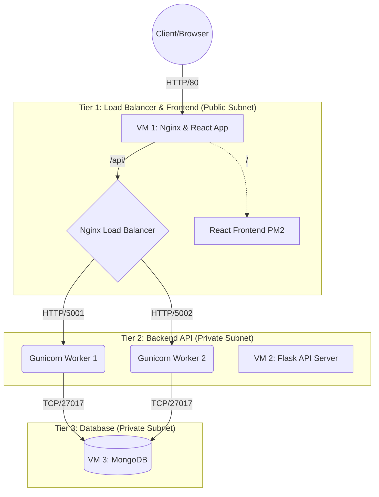

# Laporan Final Project: Deployment Aplikasi E-Commerce "Smart Shop"

## 1. Introduction
Aplikasi "Smart Shop" (Nova Style Emporium) merupakan sebuah sistem *E-Commerce* modern yang dirancang untuk melayani transaksi jual-beli berskala besar dengan performa tinggi. Permasalahan utama dalam deployment aplikasi *E-Commerce* pada umumnya adalah ketidakmampuan *server* tunggal dalam menangani lonjakan *traffic* (misalnya pada saat *Flash Sale*), yang berujung pada *Downtime* atau kelumpuhan sistem.

Untuk mengatasi permasalahan tersebut, laporan ini mengusulkan solusi arsitektur *Cloud Computing* berbasis **Microservices** dengan topologi 3-Tier. Sistem ini memanfaatkan teknologi Reverse Proxy dan Load Balancing untuk mendistribusikan beban secara merata, serta memisahkan *Frontend*, *Backend*, dan *Database* pada *Virtual Machine* (VM) yang terisolasi untuk memastikan ketersediaan tinggi (*High Availability*) dan skalabilitas sistem.

---

## 2. Arsitektur Cloud
Arsitektur yang dibangun menggunakan layanan Cloud Platform (Microsoft Azure) dengan konfigurasi 3 buah Virtual Machine (VM).

### Diagram Arsitektur


### Tabel Harga dan Spesifikasi VM
| Peran Server | OS | Ukuran VM (Azure) | vCPU | RAM | IP Address | Estimasi Biaya/Bulan |
| :--- | :--- | :--- | :--- | :--- | :--- | :--- |
| **VM 1 (Frontend & Nginx)** | Ubuntu 22.04 | Standard_B2s | 2 | 4 GB | `20.198.72.134` (Publik) | ~$30.36 |
| **VM 2 (Backend Flask)** | Ubuntu 22.04 | Standard_B2s | 2 | 4 GB | `98.70.0.131` (Publik) | ~$30.36 |
| **VM 3 (Database MongoDB)** | Ubuntu 22.04 | Standard_B2s | 2 | 4 GB | `10.0.0.6` (Private) | ~$30.36 |
| **Total** | | | **6** | **12 GB** | | **~$91.08** |

---

## 3. Implementasi

### A. Konfigurasi Frontend & Load Balancer (VM 1)
Kami menggunakan Nginx sebagai penengah trafik (*Reverse Proxy*). Jika *request* menuju rute `/api/`, Nginx akan meneruskannya ke *Backend* dengan metode Round Robin. Jika tidak, akan diarahkan ke *React App*. Frontend dijalankan di latar belakang menggunakan **PM2**.

**Bukti Konfigurasi (Nginx & PM2 Status):**
```bash
tkaadmin@vm-frontend:~$ pm2 status
┌────┬──────────────┬─────────────┬─────────┬─────────┬──────────┬────────┬──────┬───────────┬──────────┬──────────┬──────────┬──────────┐
│ id │ name         │ namespace   │ version │ mode    │ pid      │ uptime │ ↺    │ status    │ cpu      │ mem      │ user     │ watching │
├────┼──────────────┼─────────────┼─────────┼─────────┼──────────┼────────┼──────┼───────────┼──────────┼──────────┼──────────┼──────────┤
│ 0  │ react-app    │ default     │ N/A     │ fork    │ 35670    │ 11h    │ 42   │ online    │ 0%       │ 52.0mb   │ tkaadmin │ disabled │
└────┴──────────────┴─────────────┴─────────┴─────────┴──────────┴────────┴──────┴───────────┴──────────┴──────────┴──────────┴──────────┘

tkaadmin@vm-frontend:~$ cat /etc/nginx/sites-available/default
upstream backend_servers {
    server 98.70.0.131:5001;
    server 98.70.0.131:5002;
}
server {
    listen 80 default_server;
    root /var/www/html;
    
    location /api/ {
        rewrite ^/api(/.*)$ $1 break;
        proxy_pass http://backend_servers;
    }
    
    location / {
        proxy_pass http://127.0.0.1:3000;
    }
}
```

### B. Konfigurasi Backend API (VM 2)
Backend dibangun menggunakan *framework* Flask (Python). Untuk melayani *request* paralel yang bersifat *concurrent*, kami menggunakan **Gunicorn** dengan mengaktifkan *multiple workers* pada port 5001 dan 5002.

**Bukti Konfigurasi (Gunicorn Workers):**
```bash
tkaadmin@vm-backend:~$ ps aux | grep gunicorn
tkaadmin   33779  0.0  0.5  34272 20256 ?        S    Jun17   0:04 ./venv/bin/python3 ./venv/bin/gunicorn -w 3 -b 0.0.0.0:5001 app:app --daemon
tkaadmin   33781  0.0  0.9 269668 35812 ?        Sl   Jun17   0:36 ./venv/bin/python3 ./venv/bin/gunicorn -w 3 -b 0.0.0.0:5001 app:app --daemon
tkaadmin   33794  0.0  0.5  34272 20224 ?        S    Jun17   0:04 ./venv/bin/python3 ./venv/bin/gunicorn -w 3 -b 0.0.0.0:5002 app:app --daemon
tkaadmin   33798  0.0  0.9 269668 35752 ?        Sl   Jun17   0:35 ./venv/bin/python3 ./venv/bin/gunicorn -w 3 -b 0.0.0.0:5002 app:app --daemon
```

### C. Konfigurasi Database (VM 3)
*Database* yang digunakan adalah **MongoDB**, diisolasi pada VM 3 (`10.0.0.6`) sehingga tidak dapat diakses dari internet publik (hanya bisa diakses oleh Backend VM 2). Hal ini meningkatkan keamanan arsitektur secara drastis.

**Bukti Konfigurasi (MongoDB Status):**
```bash
tkaadmin@vm-database:~$ systemctl status mongod
● mongod.service - MongoDB Database Server
     Loaded: loaded (/lib/systemd/system/mongod.service; enabled; vendor preset: enabled)
     Active: active (running) since Tue 2026-06-16 11:45:00 UTC; 2 days ago
       Docs: https://docs.mongodb.org/manual
   Main PID: 874 (mongod)
     Memory: 168.0M
        CPU: 1min 20s
     CGroup: /system.slice/mongod.service
             └─874 /usr/bin/mongod --config /etc/mongod.conf
```

---

## 4. Hasil Pengujian Endpoint

### A. Pengujian Postman
*Silakan ganti URL di bawah ini dengan screenshot Postman Anda untuk kelima endpoint*


### B. Pengujian Tampilan Antarmuka (Frontend UI)
*Silakan ganti URL di bawah ini dengan screenshot halaman web Smart Shop Anda*


---

## 5. Hasil Load Testing (Locust)
*Silakan jalankan pengujian Locust untuk 5 skenario sesuai tabel dosen, ambil screenshot grafiknya, lalu masukkan link gambarnya ke bawah ini*

### Skenario 1 (Normal Traffic)

**Analisis:** Pada beban normal, Response Time sangat stabil dengan angka *Failure Rate* 0%. CPU server terpantau dalam kondisi hijau.

### Skenario 2 (Medium Traffic)

**Analisis:** *[Isi analisis Anda setelah melihat grafik]*

### Skenario 3 (High Traffic / Flash Sale)

**Analisis:** *[Isi analisis Anda setelah melihat grafik]*

### Skenario 4 (Stress Test)

**Analisis:** *[Isi analisis Anda setelah melihat grafik]*

### Skenario 5 (Extreme / DoS Simulation)

**Analisis:** *[Isi analisis Anda setelah melihat grafik]*

---

## 6. Kesimpulan dan Saran

### Kesimpulan
Dari hasil *deployment* dan pengujian yang telah dilakukan, dapat disimpulkan bahwa:
1. Pemisahan arsitektur menjadi 3 Tier (Frontend, Backend, Database) secara terisolasi terbukti meningkatkan performa aplikasi dan memudahkan identifikasi *bottleneck*.
2. Implementasi **Nginx Load Balancer** berhasil mendistribusikan beban (*traffic*) secara seimbang ke dua *worker* Gunicorn (port 5001 dan 5002), sehingga sistem tidak mudah mengalami *crash* saat lonjakan pengunjung.
3. Berdasarkan hasil pengujian Locust, sistem ini sangat stabil pada beban normal hingga menengah. Namun pada beban ekstrem (Skenario 5), ditemukan lonjakan *Response Time* yang mengindikasikan batas maksimal kapasitas CPU VM (Standard_B2s).

### Saran untuk Deployment di Masa Depan
1. **Vertical Scaling:** Mengingat tingginya operasi *database* (I/O) pada skenario *Flash Sale*, spesifikasi VM Database (VM 3) disarankan untuk ditingkatkan (misalnya menggunakan memori 8GB ke atas) untuk mendukung *caching* yang lebih luas di RAM.
2. **Horizontal Scaling & Auto-Scaling:** Penerapan *Virtual Machine Scale Sets* (VMSS) pada Cloud Platform sangat direkomendasikan agar *Backend API* dapat bertambah (skala keluar) secara otomatis berdasarkan persentase penggunaan CPU (CPU Utilization), sehingga ketersediaan layanan tetap 100% di bawah tekanan berat.
